Lesson 5
========================================================

### Multivariate Data
Notes:


```r
library(ggplot2)
setwd('C:/Users/Nicolas/Desktop/Projets Tech/Data Analysis with R/Lesson 5')
pf <- read.csv('pseudo_facebook.tsv', sep='\t')
names(pf)
```

```
##  [1] "userid"                "age"                  
##  [3] "dob_day"               "dob_year"             
##  [5] "dob_month"             "gender"               
##  [7] "tenure"                "friend_count"         
##  [9] "friendships_initiated" "likes"                
## [11] "likes_received"        "mobile_likes"         
## [13] "mobile_likes_received" "www_likes"            
## [15] "www_likes_received"
```

***

### Moira Perceived Audience Size Colored by Age
Notes:

***

### Third Qualitative Variable
Notes:


```r
ggplot(aes(x = gender, y = age),
       data = subset(pf, !is.na(gender))) + geom_boxplot() +
  stat_summary(fun.y = mean, geom = 'point', shape = 4)   # adding the mean as a x
```

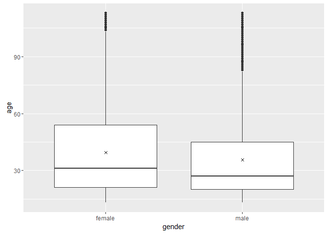


```r
ggplot(aes(x = age, y = friend_count),
       data = subset(pf, !is.na(gender))) + 
  geom_line(aes(color = gender), stat = 'summary', fun.y = median) 
```

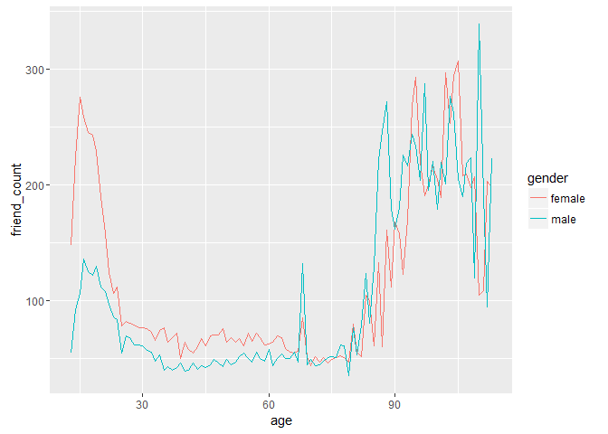

And grouping by age and gender:


```r
library(dplyr)
```

```
## 
## Attaching package: 'dplyr'
```

```
## The following objects are masked from 'package:stats':
## 
##     filter, lag
```

```
## The following objects are masked from 'package:base':
## 
##     intersect, setdiff, setequal, union
```

```r
age_gender_groups <- group_by(pf, age, gender)     # first groups data by age and gender

age_gender_groups <- filter(age_gender_groups, !is.na(gender))     # and remove all gender = NA

pf.fc_by_age_gender <- summarise(age_gender_groups,
          mean_friend_count = mean(friend_count),
          median_friend_count = median(as.numeric(friend_count)),
          n = n()
          )

pf.fc_by_age_gender <- ungroup(pf.fc_by_age_gender)    # summarise will remove one layer of grouping. So we need to ungroup one more time.

pf.fc_by_age_gender <- arrange(pf.fc_by_age_gender, age)    # and sort by age

pf.fc_by_age_gender
```

```
## Source: local data frame [202 x 5]
## 
##      age gender mean_friend_count median_friend_count     n
##    (int) (fctr)             (dbl)               (dbl) (int)
## 1     13 female          259.1606               148.0   193
## 2     13   male          102.1340                55.0   291
## 3     14 female          362.4286               224.0   847
## 4     14   male          164.1456                92.5  1078
## 5     15 female          538.6813               276.0  1139
## 6     15   male          200.6658               106.5  1478
## 7     16 female          519.5145               258.5  1238
## 8     16   male          239.6748               136.0  1848
## 9     17 female          538.9943               245.5  1236
## 10    17   male          236.4924               125.0  2045
## ..   ...    ...               ...                 ...   ...
```

Identical but using the chain operator


```r
# chain function together %>%
pf.fc_by_age_gender <- pf %>%
  filter(!is.na(gender)) %>%
  group_by(age, gender) %>%
  summarise(mean_friend_count = mean(friend_count),
          median_friend_count = median(as.numeric(friend_count)),
          n = n()) %>%
  ungroup() %>%
  arrange(age)

pf.fc_by_age_gender
```

```
## Source: local data frame [202 x 5]
## 
##      age gender mean_friend_count median_friend_count     n
##    (int) (fctr)             (dbl)               (dbl) (int)
## 1     13 female          259.1606               148.0   193
## 2     13   male          102.1340                55.0   291
## 3     14 female          362.4286               224.0   847
## 4     14   male          164.1456                92.5  1078
## 5     15 female          538.6813               276.0  1139
## 6     15   male          200.6658               106.5  1478
## 7     16 female          519.5145               258.5  1238
## 8     16   male          239.6748               136.0  1848
## 9     17 female          538.9943               245.5  1236
## 10    17   male          236.4924               125.0  2045
## ..   ...    ...               ...                 ...   ...
```


***

### Plotting Conditional Summaries
Notes: plotting the median number of friend count, per gender


```r
ggplot(aes(x = age, y = median_friend_count),
       data = pf.fc_by_age_gender) + 
  geom_line(aes(color = gender)) 
```

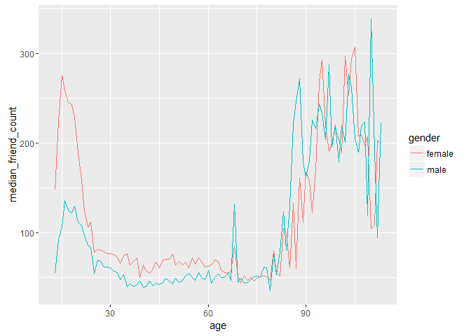


***

### Thinking in Ratios
Notes:

***

### Wide and Long Format
Notes:

***

### Reshaping Data
Notes:


```r
#install.packages('reshape2')
library(reshape2)

head(pf.fc_by_age_gender)
```

```
## Source: local data frame [6 x 5]
## 
##     age gender mean_friend_count median_friend_count     n
##   (int) (fctr)             (dbl)               (dbl) (int)
## 1    13 female          259.1606               148.0   193
## 2    13   male          102.1340                55.0   291
## 3    14 female          362.4286               224.0   847
## 4    14   male          164.1456                92.5  1078
## 5    15 female          538.6813               276.0  1139
## 6    15   male          200.6658               106.5  1478
```

```r
# convert df from long format to wide format using 'dcast'
pf.fc_by_age_gender.wide <- dcast(pf.fc_by_age_gender,
                                  age ~ gender,  # keeps age, and reshape by gender 
                                  value.var = 'mean_friend_count') # holds the values of the new dataframe

# note: to convert from wide to long format, use 'melt'

head(pf.fc_by_age_gender.wide)
```

```
##   age   female     male
## 1  13 259.1606 102.1340
## 2  14 362.4286 164.1456
## 3  15 538.6813 200.6658
## 4  16 519.5145 239.6748
## 5  17 538.9943 236.4924
## 6  18 481.9794 233.9183
```


***

### Ratio Plot
Notes:


```r
ggplot(aes(x = age, y = female/male),
       data = pf.fc_by_age_gender.wide) + 
  geom_line() +
  geom_hline(aes(yintercept=1), linetype="dashed", alpha = 0.3) +  # adding a horizontal line (y=1) as a base line
  ggtitle('Ratio of median female friend count to male')
```


***

### Third Quantitative Variable
Notes: creating a new variable 'year_joined'


```r
pf$year_joined <- floor(2014 - pf$tenure / 365)
```

***

### Cut a Variable
Notes:


```r
summary(pf$year_joined)
```

```
##    Min. 1st Qu.  Median    Mean 3rd Qu.    Max.    NA's 
##    2005    2012    2012    2012    2013    2014       2
```

```r
table(pf$year_joined)   # returns a table of the distribution
```

```
## 
##  2005  2006  2007  2008  2009  2010  2011  2012  2013  2014 
##     9    15   581  1507  4557  5448  9860 33366 43588    70
```

```r
# now let's create a categorical variable, seperating users into 4 bins
pf$year_joined.bucket <- cut(pf$year_joined, # Convert Numeric to Factor
                             c(2004,2009,2011,2012,2014)
                           )  

table(pf$year_joined.bucket)   # returns a table of the distribution
```

```
## 
## (2004,2009] (2009,2011] (2011,2012] (2012,2014] 
##        6669       15308       33366       43658
```

***

### Plotting it All Together
Notes: Create a line graph of friend_count vs. age
so that each year_joined.bucket is a line
tracking the median user friend_count across age.


```r
ggplot(aes(x = age, y = friend_count),
       data = subset(pf, !is.na(year_joined.bucket))) + 
  geom_line(aes(color = year_joined.bucket), stat = 'summary', fun.y = median) 
```

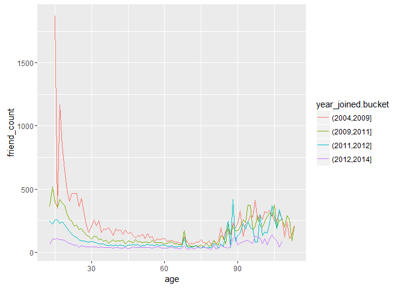

***

### Plot the Grand Mean
Notes: Add another geom_line to plot the grand mean of the friend count vs age.


```r
ggplot(aes(x = age, y = friend_count),
       data = subset(pf, !is.na(year_joined.bucket))) + 
  geom_line(aes(color = year_joined.bucket), stat = 'summary', fun.y = mean) +
  geom_line(stat = 'summary', fun.y = mean, linetype = 2) +  # adding the Grand Mean 
  ggtitle('Mean of friend count over the age, per year joined')
```

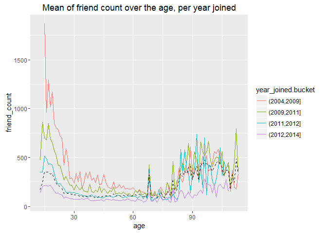

***

### Friending Rate
Notes: how many friends an user gets each day since his join date?
Subset the data so we consider only users with one day of tenure


```r
pf$friending_rate <- pf$friend_count / pf$tenure
summary(pf[pf$tenure>=1,]$friending_rate)
```

```
##     Min.  1st Qu.   Median     Mean  3rd Qu.     Max.     NA's 
##   0.0000   0.0775   0.2205   0.6096   0.5658 417.0000        2
```

```r
pf$friending_rate <- NULL

# or alternatively
with(subset(pf, tenure >= 1), summary(friend_count/tenure))
```

```
##     Min.  1st Qu.   Median     Mean  3rd Qu.     Max. 
##   0.0000   0.0775   0.2205   0.6096   0.5658 417.0000
```

What is the median friend rate? .22

What is the maximum friend rate? 417

***

### Friendships Initiated
Notes: Plot the number of friendship initiated per day vs tenure
Subset the data so we consider only users with one day of tenure


```r
ggplot(aes(x = tenure, y = friendships_initiated/tenure),
       data = subset(pf, tenure >= 1)) + 
  geom_line(aes(color = year_joined.bucket), stat = 'summary', fun.y = median) 
```

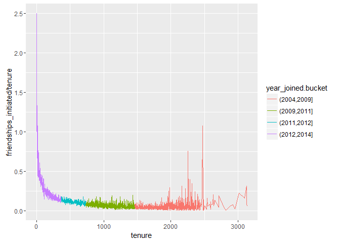

***

### Bias-Variance Tradeoff Revisited
Notes: add a smoother to the plot.


```r
ggplot(aes(x = tenure, y = friendships_initiated / tenure),
       data = subset(pf, tenure >= 1)) +
  geom_line(aes(color = year_joined.bucket),
            stat = 'summary',
            fun.y = mean)
```

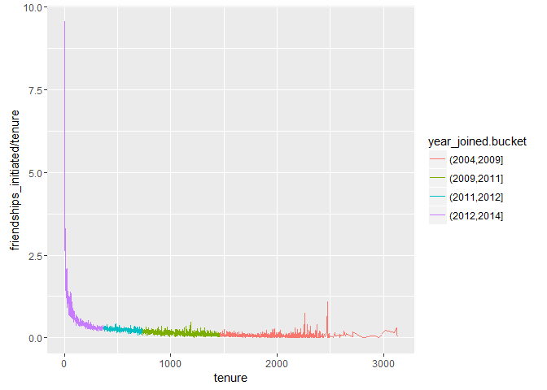

```r
ggplot(aes(x = 7 * round(tenure / 7), y = friendships_initiated / tenure),
       data = subset(pf, tenure > 0)) +
  geom_line(aes(color = year_joined.bucket),
            stat = "summary",
            fun.y = mean)
```

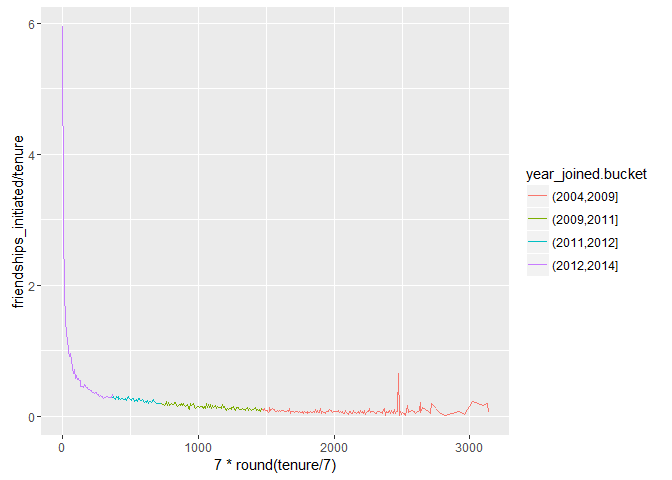

```r
ggplot(aes(x = 30 * round(tenure / 30), y = friendships_initiated / tenure),
       data = subset(pf, tenure > 0)) +
  geom_line(aes(color = year_joined.bucket),
            stat = "summary",
            fun.y = mean)
```

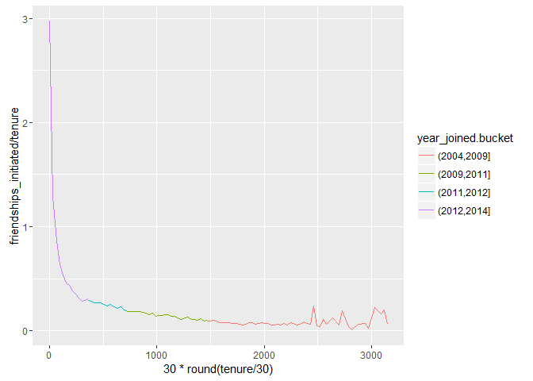

```r
ggplot(aes(x = 90 * round(tenure / 90), y = friendships_initiated / tenure),
       data = subset(pf, tenure > 0)) +
  geom_line(aes(color = year_joined.bucket),
            stat = "summary",
            fun.y = mean)
```

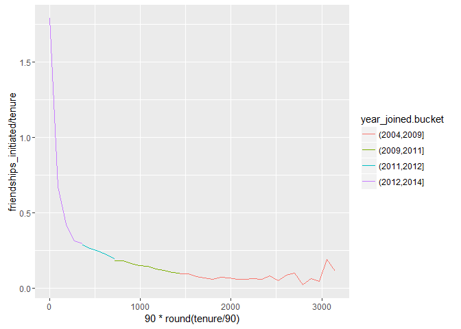

```r
# Similar, but instead of geom_line(), use geom_smooth() to add a smoother to the plot
ggplot(aes(x = tenure, y = friendships_initiated / tenure),
       data = subset(pf, tenure > 0)) +
  geom_smooth(aes(color = year_joined.bucket)) 
```

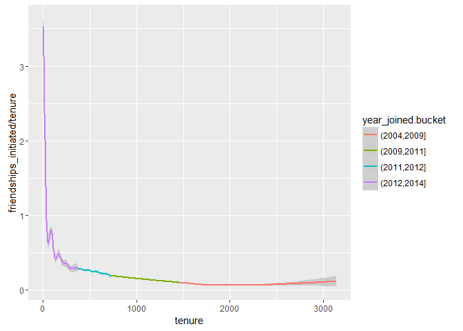

***

### Sean's NFL Fan Sentiment Study
Notes:

***

### Introducing the Yogurt Data Set
Notes:

***

### Histograms Revisited
Notes:


```r
yo <- read.csv('yogurt.csv')
str(yo)
```

```
## 'data.frame':	2380 obs. of  9 variables:
##  $ obs        : int  1 2 3 4 5 6 7 8 9 10 ...
##  $ id         : int  2100081 2100081 2100081 2100081 2100081 2100081 2100081 2100081 2100081 2100081 ...
##  $ time       : int  9678 9697 9825 9999 10015 10029 10036 10042 10083 10091 ...
##  $ strawberry : int  0 0 0 0 1 1 0 0 0 0 ...
##  $ blueberry  : int  0 0 0 0 0 0 0 0 0 0 ...
##  $ pina.colada: int  0 0 0 0 1 2 0 0 0 0 ...
##  $ plain      : int  0 0 0 0 0 0 0 0 0 0 ...
##  $ mixed.berry: int  1 1 1 1 1 1 1 1 1 1 ...
##  $ price      : num  59 59 65 65 49 ...
```

```r
# Change the id from an int to a factor
yo$id <- factor(yo$id)
str(yo)
```

```
## 'data.frame':	2380 obs. of  9 variables:
##  $ obs        : int  1 2 3 4 5 6 7 8 9 10 ...
##  $ id         : Factor w/ 332 levels "2100081","2100370",..: 1 1 1 1 1 1 1 1 1 1 ...
##  $ time       : int  9678 9697 9825 9999 10015 10029 10036 10042 10083 10091 ...
##  $ strawberry : int  0 0 0 0 1 1 0 0 0 0 ...
##  $ blueberry  : int  0 0 0 0 0 0 0 0 0 0 ...
##  $ pina.colada: int  0 0 0 0 1 2 0 0 0 0 ...
##  $ plain      : int  0 0 0 0 0 0 0 0 0 0 ...
##  $ mixed.berry: int  1 1 1 1 1 1 1 1 1 1 ...
##  $ price      : num  59 59 65 65 49 ...
```

```r
# create an histogram of the yogurt prices
ggplot(data = yo, aes(x = price)) + geom_histogram(bins = 30, fill = I('#F79420'))
```

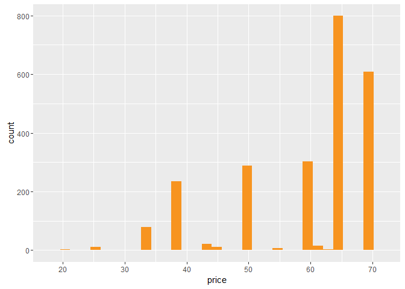

This plot gives a clue of the discreteness of the price variable

***

### Number of Purchases
Notes: Create a new variable called all.purchases,
which gives the total counts of yogurt for
each observation or household


```r
yo <- transform(yo, all.purchases = strawberry + blueberry + pina.colada + plain + mixed.berry) 
```

***

### Prices over Time
Notes: Create a scatterplot of price vs time


```r
ggplot(data = yo, aes(x = time, y = price)) + 
  geom_jitter(alpha = 1/4, shape = 21, fill = I('#F79420'))
```

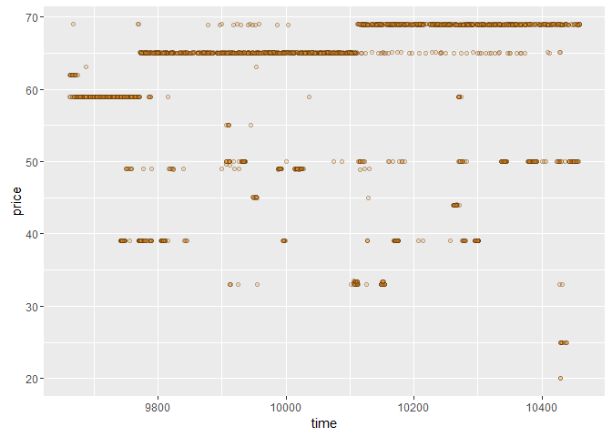

```r
# alpha allows to resolve overplotting
```

***

### Sampling Observations
Notes:

***

### Looking at Samples of Households


```r
# set the seed for reproducible results
set.seed(4230)
sample.ids <- sample(levels(yo$id), 16)  # select 16 id at random in the total number of levels of id

ggplot(aes(x = time, y = price),
       data = subset(yo, id %in% sample.ids)) +
  facet_wrap(~ id) +
  geom_line() +
  geom_point(aes(size = all.purchases), pch = 1)
```

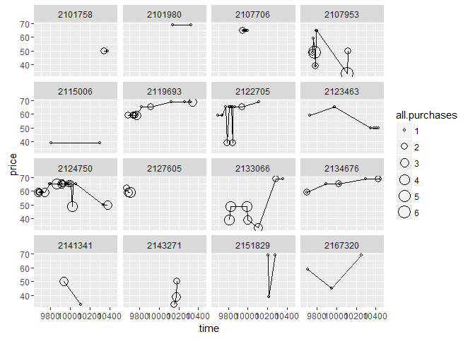

***

### The Limits of Cross Sectional Data
Notes:

***

### Many Variables
Notes:

***

### Scatterplot Matrix
Notes:


```r
#install.packages('GGally')
library(GGally)
```

```
## Warning: package 'GGally' was built under R version 3.2.4
```

```
## 
## Attaching package: 'GGally'
```

```
## The following object is masked from 'package:dplyr':
## 
##     nasa
```

```r
theme_set(theme_minimal(20))

# set the seed for reproducible results
set.seed(4230)
pf_subset <- pf[, c(2:7)]   # compare only a smaller number of variables
names(pf_subset)
```

```
## [1] "age"       "dob_day"   "dob_year"  "dob_month" "gender"    "tenure"
```

```r
ggpairs(pf_subset[sample.int(nrow(pf_subset), 1000), ])
```

```
## `stat_bin()` using `bins = 30`. Pick better value with `binwidth`.
```

```
## `stat_bin()` using `bins = 30`. Pick better value with `binwidth`.
## `stat_bin()` using `bins = 30`. Pick better value with `binwidth`.
## `stat_bin()` using `bins = 30`. Pick better value with `binwidth`.
## `stat_bin()` using `bins = 30`. Pick better value with `binwidth`.
```

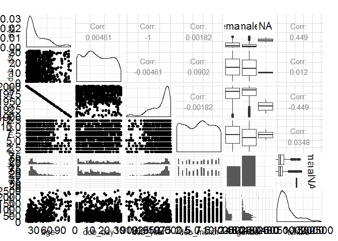


***

### Even More Variables
Notes:

***

### Heat Maps
Notes:


```r
setwd('C:/Users/Nicolas/Desktop/Projets Tech/Data Analysis with R/')
nci <- read.table("nci.tsv")
colnames(nci) <- c(1:64)
```


```r
library(ggplot2)
library(reshape2)

nci.long.samp <- melt(as.matrix(nci[1:200,]))
names(nci.long.samp) <- c("gene", "case", "value")
head(nci.long.samp)
```

```
##   gene case  value
## 1    1    1  0.300
## 2    2    1  1.180
## 3    3    1  0.550
## 4    4    1  1.140
## 5    5    1 -0.265
## 6    6    1 -0.070
```

```r
ggplot(aes(y = gene, x = case, fill = value),
  data = nci.long.samp) +
  geom_tile() +
  scale_fill_gradientn(colours = colorRampPalette(c("blue", "red"))(100))
```

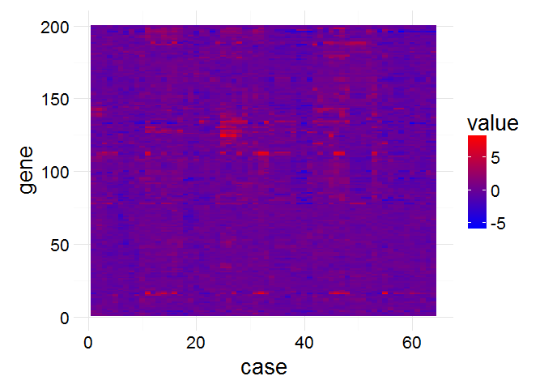


***

### Analyzing Three of More Variables
Reflection:

***

Click **KnitHTML** to see all of your hard work and to have an html
page of this lesson, your answers, and your notes!

