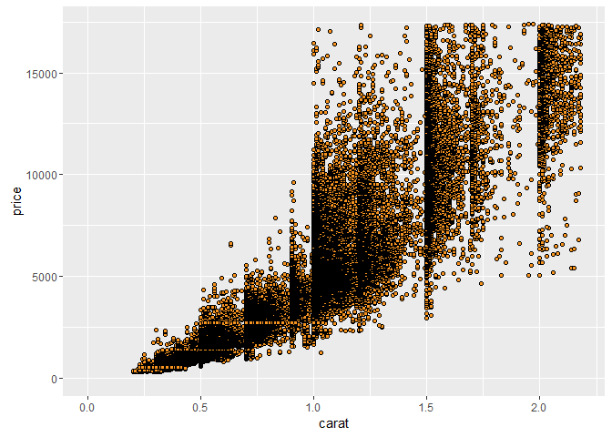
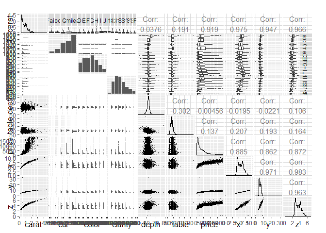
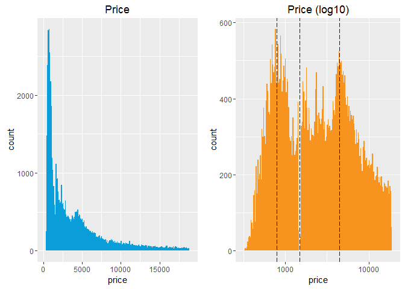
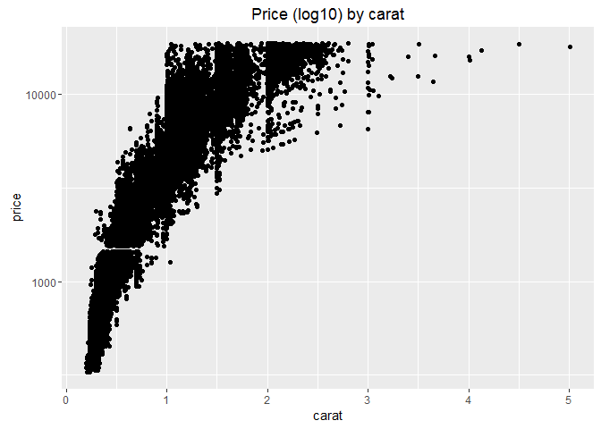
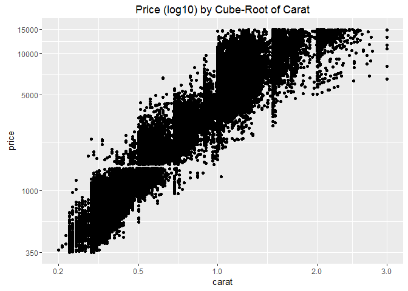
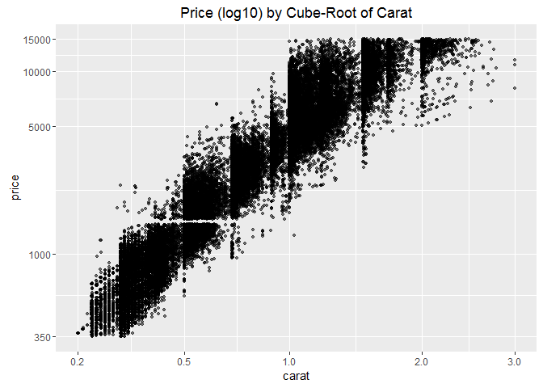
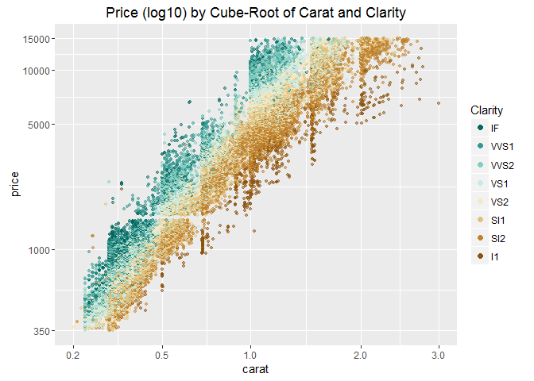
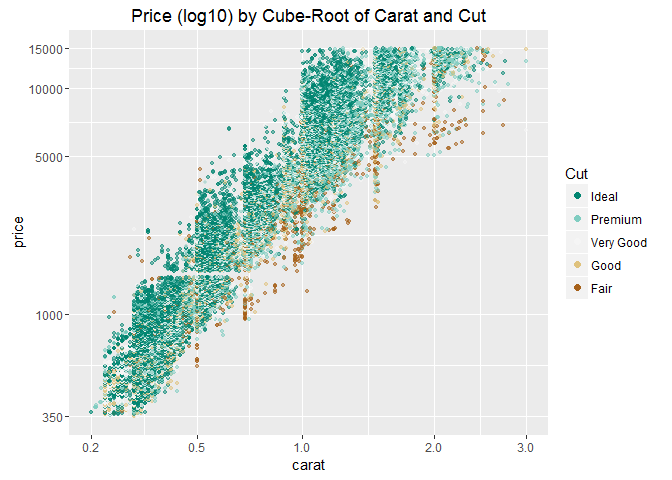
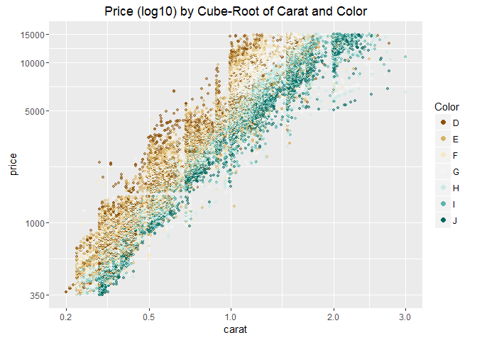

Lesson 6: Diamonds and Price Predictions
========================================================


### Scatterplot Review


```r
library(ggplot2)
data(diamonds)
summary(diamonds)
```

```r
ggplot(aes(x=carat, y=price), data = diamonds) + 
  geom_point(fill=I('#F79420'), color=I('black'), shape=21) +
  xlim(0, quantile(diamonds$carat, probs = 0.99)) +
  ylim(0, quantile(diamonds$price, probs = 0.99))
```




***

### ggpairs Function

```r
# install these if necessary
#install.packages('GGally')
#install.packages('scales')
#install.packages('memisc')
#install.packages('lattice')
#install.packages('MASS')
#install.packages('car')
#install.packages('reshape2')
#install.packages('dplyr')
```

```r
library(GGally)
library(scales)
library(memisc)
```

```r
# sample 10,000 diamonds from the data set
set.seed(20022012)
diamond_samp <- diamonds[sample(1:length(diamonds$price), 10000), ]
#ggpairs(diamond_samp, params = c(shape = I('.'), outlier.shape = I('.')))
ggpairs(diamond_samp,
        lower = list(continuous = wrap("points", shape = I('.'))),
        upper = list(combo = wrap("box", outlier.shape = I('.'))))
```





***

### The Demand of Diamonds

```r
library(gridExtra)
library(ggplot2)

plot1 <- ggplot(aes(price), data = diamonds) + 
  geom_histogram(binwidth = 100, fill=I('#099DD9')) +
  ggtitle('Price') 

plot2 <- ggplot(aes(price), data = diamonds) + 
  geom_histogram(binwidth = 0.01, fill=I('#F79420')) +
  scale_x_log10() +
  ggtitle('Price (log10)') +
  geom_vline(xintercept=800, col="blue",linetype = "longdash") +
  geom_vline(xintercept=1500, col="blue",linetype = "longdash") +
  geom_vline(xintercept=4500, col="blue",linetype = "longdash")

grid.arrange(plot1,plot2, ncol=2)
```



***

### Connecting Demand and Price Distributions
Notes: Peak of demand for diamonds which costs about $800 (poor buyer) and $4,500 (rich buyer). Drop of demand for price of $1,500.

***

### Scatterplot Transformation
Create two histograms of the price variable and place them side by side on one output image. The first plot should be a histogram of price and the second plot should transform the price variable using log10.

```r
ggplot(aes(x=carat,y=price), data = diamonds) + 
  geom_point() +
  scale_y_log10() +   # same as scale_y_continuous(trans = log10_trans())
  ggtitle('Price (log10) by carat')
```




### Create a new function to transform the carat variable


```r
library(scales)
cuberoot_trans = function() trans_new('cuberoot', 
                                      transform = function(x) x^(1/3),
                                      inverse = function(x) x^3)
```

#### Use the cuberoot_trans function
Notes: carat (weight) is a function of volume. Flaws is assumed to be exponentially more likely in diamonds with more volume (volume is on a cubic scale). Also, Price is a function of flaws. Let's make sure.


```r
ggplot(aes(carat, price), data = diamonds) + 
  geom_point() + 
  scale_x_continuous(trans = cuberoot_trans(), limits = c(0.2, 3),
                     breaks = c(0.2, 0.5, 1, 2, 3)) + 
  scale_y_continuous(trans = log10_trans(), limits = c(350, 15000),
                     breaks = c(350, 1000, 5000, 10000, 15000)) +
  ggtitle('Price (log10) by Cube-Root of Carat')
```



***

### Overplotting Revisited


```r
head(  sort( table(diamonds$carat), decreasing = T )  ) # first line is the carat, the second line is the count
```

```
## 
##  0.3 0.31 1.01  0.7 0.32    1 
## 2604 2249 2242 1981 1840 1558
```

```r
head(  sort( table(diamonds$price), decreasing = T )  ) # first line is the price, the second line is the count
```

```
## 
## 605 802 625 828 776 698 
## 132 127 126 125 124 121
```

```r
ggplot(aes(carat, price), data = diamonds) + 
  geom_point(alpha = 1/2, size = 1, position = 'jitter') + 
  scale_x_continuous(trans = cuberoot_trans(), limits = c(0.2, 3),
                     breaks = c(0.2, 0.5, 1, 2, 3)) + 
  scale_y_continuous(trans = log10_trans(), limits = c(350, 15000),
                     breaks = c(350, 1000, 5000, 10000, 15000)) +
  ggtitle('Price (log10) by Cube-Root of Carat')
```



Notes: This gives a better sense of how dense or sparse the data is at key places.


***

### Price vs. Carat and Clarity

ColorBrewer provides sequential, diverging and qualitative colour schemes which are particularly suited and tested to display discrete values (levels of a factor) on a map. ggplot2 can use those colours in discrete scales. It also allows to smoothly interpolate 6 colours from any palette to a continuous scale

```r
# install and load the RColorBrewer package
#install.packages('RColorBrewer')
library(RColorBrewer)

ggplot(aes(x = carat, y = price,  color=clarity), data = diamonds) + 
  geom_point(alpha = 0.5, size = 1, position = 'jitter') +
  scale_color_brewer(type = 'div',
    guide = guide_legend(title = 'Clarity', reverse = T,  # reverse the items in legend and override the aesthetics
    override.aes = list(alpha = 1, size = 2))) +  
  scale_x_continuous(trans = cuberoot_trans(), limits = c(0.2, 3),
    breaks = c(0.2, 0.5, 1, 2, 3)) + 
  scale_y_continuous(trans = log10_trans(), limits = c(350, 15000),
    breaks = c(350, 1000, 5000, 10000, 15000)) +
  ggtitle('Price (log10) by Cube-Root of Carat and Clarity')
```



***

### Clarity and Price
Response: Per the color pattern on the plot, Clarity seems to accounts for some of the variance in Price

***

### Price vs. Carat and Cut

```r
ggplot(aes(x = carat, y = price, color = cut), data = diamonds) + 
  geom_point(alpha = 0.5, size = 1, position = 'jitter') +
  scale_color_brewer(type = 'div',
                     guide = guide_legend(title = 'Cut', reverse = T,
                                          override.aes = list(alpha = 1, size = 2))) +  
  scale_x_continuous(trans = cuberoot_trans(), limits = c(0.2, 3),
                     breaks = c(0.2, 0.5, 1, 2, 3)) + 
  scale_y_continuous(trans = log10_trans(), limits = c(350, 15000),
                     breaks = c(350, 1000, 5000, 10000, 15000)) +
  ggtitle('Price (log10) by Cube-Root of Carat and Cut')
```




***

### Cut and Price
Response: Most of the diamonds have an "ideal" cut. Cut seems to have a limited impact on the variance in Price 

***

### Price vs. Carat and Color


```r
ggplot(aes(x = carat, y = price, color = color), data = diamonds) + 
  geom_point(alpha = 0.5, size = 1, position = 'jitter') +
  scale_color_brewer(type = 'div',
                     guide = guide_legend(title = 'Color',reverse = F,  # remove the reverse order because the best color should be at the top the legend
                                          override.aes = list(alpha = 1, size = 2))) +  
  scale_x_continuous(trans = cuberoot_trans(), limits = c(0.2, 3),
                     breaks = c(0.2, 0.5, 1, 2, 3)) + 
  scale_y_continuous(trans = log10_trans(), limits = c(350, 15000),
                     breaks = c(350, 1000, 5000, 10000, 15000)) +
  ggtitle('Price (log10) by Cube-Root of Carat and Color')
```




***

### Color and Price
Response: Per the color pattern on the plot, Color seems to accounts for some of the variance in Price

***

### Linear Models in R
Notes: to predict the price, we'll use the lm(y~x) function, where y is the outcome variable and x is the explanatory variable. 
Price is the outcome and carat is the predictor variable. We used our domain knowledge of diamonds and carat weight to take the cube root of carat weight (volume):
- long tailed price distribution
- assumption that flawless diamonds should become exponentially rare as diamond volume increases

***

### Building the Linear Model
Notes: Create 5 models using the lm() function:
- The response on the left of the tilde ~ (read "is modeled as")
- A list of predictors on the right of the tilde ~ (separated by '+')
See http://data.princeton.edu/R/linearModels.html for more info.

```r
library(scales)
library(memisc)
# use the I() operator (='as is') which inhibits interpretation/conversion of objects. By protecting the expression, ensures it is interpreted in the obvious arithmetical way.
m1 <- lm(I(log(price)) ~ I(carat^(1/3)), data = diamonds)
m2 <- update(m1, ~ . + carat)   # adding the carat variable to the regression
m3 <- update(m2, ~ . + cut)
m4 <- update(m3, ~ . + color)
m5 <- update(m4, ~ . + clarity)
mtable(m1, m2, m3, m4, m5)
```

```
## 
## Calls:
## m1: lm(formula = I(log(price)) ~ I(carat^(1/3)), data = diamonds)
## m2: lm(formula = I(log(price)) ~ I(carat^(1/3)) + carat, data = diamonds)
## m3: lm(formula = I(log(price)) ~ I(carat^(1/3)) + carat + cut, data = diamonds)
## m4: lm(formula = I(log(price)) ~ I(carat^(1/3)) + carat + cut + color, 
##     data = diamonds)
## m5: lm(formula = I(log(price)) ~ I(carat^(1/3)) + carat + cut + color + 
##     clarity, data = diamonds)
## 
## =========================================================================
##                      m1         m2         m3         m4         m5      
## -------------------------------------------------------------------------
##   (Intercept)      2.821***   1.039***   0.874***   0.932***   0.415***  
##                   (0.006)    (0.019)    (0.019)    (0.017)    (0.010)    
##   I(carat^(1/3))   5.558***   8.568***   8.703***   8.438***   9.144***  
##                   (0.007)    (0.032)    (0.031)    (0.028)    (0.016)    
##   carat                      -1.137***  -1.163***  -0.992***  -1.093***  
##                              (0.012)    (0.011)    (0.010)    (0.006)    
##   cut: .L                                0.224***   0.224***   0.120***  
##                                         (0.004)    (0.004)    (0.002)    
##   cut: .Q                               -0.062***  -0.062***  -0.031***  
##                                         (0.004)    (0.003)    (0.002)    
##   cut: .C                                0.051***   0.052***   0.014***  
##                                         (0.003)    (0.003)    (0.002)    
##   cut: ^4                                0.018***   0.018***  -0.002     
##                                         (0.003)    (0.002)    (0.001)    
##   color: .L                                        -0.373***  -0.441***  
##                                                    (0.003)    (0.002)    
##   color: .Q                                        -0.129***  -0.093***  
##                                                    (0.003)    (0.002)    
##   color: .C                                         0.001     -0.013***  
##                                                    (0.003)    (0.002)    
##   color: ^4                                         0.029***   0.012***  
##                                                    (0.003)    (0.002)    
##   color: ^5                                        -0.016***  -0.003*    
##                                                    (0.003)    (0.001)    
##   color: ^6                                        -0.023***   0.001     
##                                                    (0.002)    (0.001)    
##   clarity: .L                                                  0.907***  
##                                                               (0.003)    
##   clarity: .Q                                                 -0.240***  
##                                                               (0.003)    
##   clarity: .C                                                  0.131***  
##                                                               (0.003)    
##   clarity: ^4                                                 -0.063***  
##                                                               (0.002)    
##   clarity: ^5                                                  0.026***  
##                                                               (0.002)    
##   clarity: ^6                                                 -0.002     
##                                                               (0.002)    
##   clarity: ^7                                                  0.032***  
##                                                               (0.001)    
## -------------------------------------------------------------------------
##   R-squared            0.9        0.9        0.9        1.0        1.0   
##   adj. R-squared       0.9        0.9        0.9        1.0        1.0   
##   sigma                0.3        0.3        0.3        0.2        0.1   
##   F               652012.1   387489.4   138654.5    87959.5   173791.1   
##   p                    0.0        0.0        0.0        0.0        0.0   
##   Log-likelihood   -7962.5    -3631.3    -1837.4     4235.2    34091.3   
##   Deviance          4242.8     3613.4     3380.8     2699.2      892.2   
##   AIC              15931.0     7270.6     3690.8    -8442.5   -68140.5   
##   BIC              15957.7     7306.2     3762.0    -8317.9   -67953.7   
##   N                53940      53940      53940      53940      53940     
## =========================================================================
```

Notice how adding cut to our model does not help explain much of the variance
in the price of diamonds. This fits with our exploration earlier.

***

### Model Problems

Response: data from 2008 to 2014: 
- adjustment by inflation (but not only)
- 2008 global recession, growing about 6%/year since
- diamond market in china neating up, might also explain that increase
- uneven recovery/price increase across different carat weight since 2008

***

### A Bigger, Better Data Set

```r
#install.package('bitops')
#install.packages('RCurl')
library('bitops')
library('RCurl')

load("BigDiamonds.rda")
```

The code used to obtain the data is available here: https://github.com/solomonm/diamonds-data

## Building a Model Using the Big Diamonds Data Set

```r
library(scales)
library(memisc)

m1 <- lm(I(log(price)) ~ I(carat^(1/3)), 
         data = diamondsbig[ !is.na(diamondsbig$price) &  (diamondsbig$price<10000) & diamondsbig$cert == 'GIA' , ]  )     # remove entries w/o price, price above 10k, and w/o GIA certification
m2 <- update(m1, ~ . + carat)  
m3 <- update(m2, ~ . + cut)
m4 <- update(m3, ~ . + color)
m5 <- update(m4, ~ . + clarity)
mtable(m1, m2, m3, m4, m5)
```

```
## 
## Calls:
## m1: lm(formula = I(log(price)) ~ I(carat^(1/3)), data = diamondsbig[!is.na(diamondsbig$price) & 
##     (diamondsbig$price < 10000) & diamondsbig$cert == "GIA", 
##     ])
## m2: lm(formula = I(log(price)) ~ I(carat^(1/3)) + carat, data = diamondsbig[!is.na(diamondsbig$price) & 
##     (diamondsbig$price < 10000) & diamondsbig$cert == "GIA", 
##     ])
## m3: lm(formula = I(log(price)) ~ I(carat^(1/3)) + carat + cut, data = diamondsbig[!is.na(diamondsbig$price) & 
##     (diamondsbig$price < 10000) & diamondsbig$cert == "GIA", 
##     ])
## m4: lm(formula = I(log(price)) ~ I(carat^(1/3)) + carat + cut + color, 
##     data = diamondsbig[!is.na(diamondsbig$price) & (diamondsbig$price < 
##         10000) & diamondsbig$cert == "GIA", ])
## m5: lm(formula = I(log(price)) ~ I(carat^(1/3)) + carat + cut + color + 
##     clarity, data = diamondsbig[!is.na(diamondsbig$price) & (diamondsbig$price < 
##     10000) & diamondsbig$cert == "GIA", ])
## 
## =========================================================================
##                      m1         m2         m3         m4         m5      
## -------------------------------------------------------------------------
##   (Intercept)      2.671***   1.333***   0.949***   0.529***  -0.464***  
##                   (0.003)    (0.012)    (0.012)    (0.010)    (0.009)    
##   I(carat^(1/3))   5.839***   8.243***   8.633***   8.110***   8.320***  
##                   (0.004)    (0.022)    (0.021)    (0.017)    (0.012)    
##   carat                      -1.061***  -1.223***  -0.782***  -0.763***  
##                              (0.009)    (0.009)    (0.007)    (0.005)    
##   cut: V.Good                            0.120***   0.090***   0.071***  
##                                         (0.002)    (0.001)    (0.001)    
##   cut: Ideal                             0.211***   0.181***   0.131***  
##                                         (0.002)    (0.001)    (0.001)    
##   color: K/L                                        0.123***   0.117***  
##                                                    (0.004)    (0.003)    
##   color: J/L                                        0.312***   0.318***  
##                                                    (0.003)    (0.002)    
##   color: I/L                                        0.451***   0.469***  
##                                                    (0.003)    (0.002)    
##   color: H/L                                        0.569***   0.602***  
##                                                    (0.003)    (0.002)    
##   color: G/L                                        0.633***   0.665***  
##                                                    (0.003)    (0.002)    
##   color: F/L                                        0.687***   0.723***  
##                                                    (0.003)    (0.002)    
##   color: E/L                                        0.729***   0.756***  
##                                                    (0.003)    (0.002)    
##   color: D/L                                        0.812***   0.827***  
##                                                    (0.003)    (0.002)    
##   clarity: I1                                                  0.301***  
##                                                               (0.006)    
##   clarity: SI2                                                 0.607***  
##                                                               (0.006)    
##   clarity: SI1                                                 0.727***  
##                                                               (0.006)    
##   clarity: VS2                                                 0.836***  
##                                                               (0.006)    
##   clarity: VS1                                                 0.891***  
##                                                               (0.006)    
##   clarity: VVS2                                                0.935***  
##                                                               (0.006)    
##   clarity: VVS1                                                0.995***  
##                                                               (0.006)    
##   clarity: IF                                                  1.052***  
##                                                               (0.006)    
## -------------------------------------------------------------------------
##   R-squared             0.9        0.9       0.9        0.9         1.0  
##   adj. R-squared        0.9        0.9       0.9        0.9         1.0  
##   sigma                 0.3        0.3       0.3        0.2         0.2  
##   F               2700903.7  1406538.3  754405.4   423311.5    521161.4  
##   p                     0.0        0.0       0.0        0.0         0.0  
##   Log-likelihood   -60137.8   -53996.3  -43339.8    37830.4    154124.3  
##   Deviance          28298.7    27291.5   25628.3    15874.9      7992.7  
##   AIC              120281.6   108000.5   86691.6   -75632.8   -308204.5  
##   BIC              120313.8   108043.5   86756.0   -75482.6   -307968.4  
##   N                338946     338946    338946     338946      338946    
## =========================================================================
```


***

## Predictions

Example Diamond from BlueNile:
Round 1.00 Very Good I VS1 $5,601


```r
#Be sure you have loaded the library memisc and have m5 saved as an object in your workspace.
thisDiamond = data.frame(carat = 1.00, cut = "V.Good",
                         color = "I", clarity="VS1")
modelEstimate = predict(m5, newdata = thisDiamond,
                        interval="prediction", level = .95)

# Taking the exponential of the predicted log(price) to compute the predicted price: 
exp(modelEstimate)
```

```
##        fit     lwr      upr
## 1 5040.436 3730.34 6810.638
```

Evaluate how well the model predicts the BlueNile diamond's price. Think about the fitted point estimate as well as the 95% CI.

Results:
- Ground truth: price = $5,601
- Prediction: price = $5,040  (within the 95% CI)
- Error = -$560 or -9.9%

