# Problem Set 3
Nicolas  
February 17, 2016  

1. Diamonds Dataset
===========================================================================

***

### Loading the dataset


```r
library(ggplot2)
getwd()
```

```
## [1] "C:/Users/Nicolas/Desktop/Projets Tech/Data Analysis with R/Lesson 3"
```

```r
setwd('C:/Users/Nicolas/Desktop/Projets Tech/Data Analysis with R/Lesson 3')
list.files()
```

```
## [1] "birthdaysExample.csv"       "Electricity Generation.csv"
## [3] "Lesson 3.rmd"               "Lesson_3.html"             
## [5] "Lesson_3.md"                "Lesson_3_files"            
## [7] "Problem Set 3.rmd"          "Problem_Set_3.rmd"         
## [9] "pseudo_facebook.tsv"
```

```r
data(diamonds)
summary(diamonds)
```

```
##      carat               cut        color        clarity     
##  Min.   :0.2000   Fair     : 1610   D: 6775   SI1    :13065  
##  1st Qu.:0.4000   Good     : 4906   E: 9797   VS2    :12258  
##  Median :0.7000   Very Good:12082   F: 9542   SI2    : 9194  
##  Mean   :0.7979   Premium  :13791   G:11292   VS1    : 8171  
##  3rd Qu.:1.0400   Ideal    :21551   H: 8304   VVS2   : 5066  
##  Max.   :5.0100                     I: 5422   VVS1   : 3655  
##                                     J: 2808   (Other): 2531  
##      depth           table           price             x         
##  Min.   :43.00   Min.   :43.00   Min.   :  326   Min.   : 0.000  
##  1st Qu.:61.00   1st Qu.:56.00   1st Qu.:  950   1st Qu.: 4.710  
##  Median :61.80   Median :57.00   Median : 2401   Median : 5.700  
##  Mean   :61.75   Mean   :57.46   Mean   : 3933   Mean   : 5.731  
##  3rd Qu.:62.50   3rd Qu.:59.00   3rd Qu.: 5324   3rd Qu.: 6.540  
##  Max.   :79.00   Max.   :95.00   Max.   :18823   Max.   :10.740  
##                                                                  
##        y                z         
##  Min.   : 0.000   Min.   : 0.000  
##  1st Qu.: 4.720   1st Qu.: 2.910  
##  Median : 5.710   Median : 3.530  
##  Mean   : 5.735   Mean   : 3.539  
##  3rd Qu.: 6.540   3rd Qu.: 4.040  
##  Max.   :58.900   Max.   :31.800  
## 
```

```r
str(diamonds)   # structure of an object
```

```
## Classes 'tbl_df', 'tbl' and 'data.frame':	53940 obs. of  10 variables:
##  $ carat  : num  0.23 0.21 0.23 0.29 0.31 0.24 0.24 0.26 0.22 0.23 ...
##  $ cut    : Ord.factor w/ 5 levels "Fair"<"Good"<..: 5 4 2 4 2 3 3 3 1 3 ...
##  $ color  : Ord.factor w/ 7 levels "D"<"E"<"F"<"G"<..: 2 2 2 6 7 7 6 5 2 5 ...
##  $ clarity: Ord.factor w/ 8 levels "I1"<"SI2"<"SI1"<..: 2 3 5 4 2 6 7 3 4 5 ...
##  $ depth  : num  61.5 59.8 56.9 62.4 63.3 62.8 62.3 61.9 65.1 59.4 ...
##  $ table  : num  55 61 65 58 58 57 57 55 61 61 ...
##  $ price  : int  326 326 327 334 335 336 336 337 337 338 ...
##  $ x      : num  3.95 3.89 4.05 4.2 4.34 3.94 3.95 4.07 3.87 4 ...
##  $ y      : num  3.98 3.84 4.07 4.23 4.35 3.96 3.98 4.11 3.78 4.05 ...
##  $ z      : num  2.43 2.31 2.31 2.63 2.75 2.48 2.47 2.53 2.49 2.39 ...
```


***

## Create a histogram of the price of all the diamonds in the diamond data set.

```r
qplot(data = diamonds, price)
```

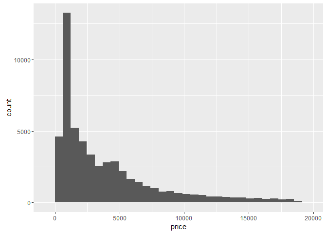

```r
summary(diamonds$price)
```

```
##    Min. 1st Qu.  Median    Mean 3rd Qu.    Max. 
##     326     950    2401    3933    5324   18820
```

***

## Diamonds counts


```r
dim( subset(diamonds, price < 500) )
```

```
## [1] 1729   10
```

```r
dim( subset(diamonds, price < 250) )
```

```
## [1]  0 10
```

```r
dim( subset(diamonds, price >= 15000) )
```

```
## [1] 1656   10
```

***

## Explore the histogram of the price


```r
qplot(data = diamonds, price, binwidth = 20) +
  scale_x_continuous(limits = c(300, 1500),
                     breaks = seq(300, 1500, 100))
```

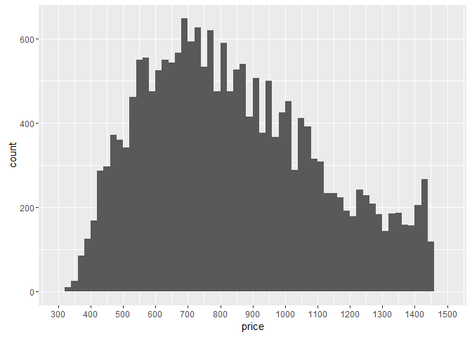

```r
ggsave('priceHistogram.png')
```

***

## Explore the histogram of the price, by cut


```r
qplot(data = diamonds, price, binwidth = 20) +
  scale_x_continuous(limits = c(300, 15000),
                     breaks = seq(300, 15000, 1000)) +   
  facet_wrap(~cut, ncol = 1)   
```

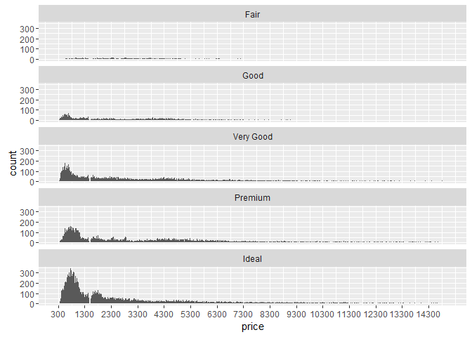

```r
# display the max price per cut by(diamonds$price, diamonds$cut, max) 
```

```
## diamonds$cut: Fair
## [1] 18574
## -------------------------------------------------------- 
## diamonds$cut: Good
## [1] 18788
## -------------------------------------------------------- 
## diamonds$cut: Very Good
## [1] 18818
## -------------------------------------------------------- 
## diamonds$cut: Premium
## [1] 18823
## -------------------------------------------------------- 
## diamonds$cut: Ideal
## [1] 18806
```

```r
max( by(diamonds$price, diamonds$cut, max) )
```

```
## [1] 18823
```

```r
# display the min price per cut
by(diamonds$price, diamonds$cut, min)
```

```
## diamonds$cut: Fair
## [1] 337
## -------------------------------------------------------- 
## diamonds$cut: Good
## [1] 327
## -------------------------------------------------------- 
## diamonds$cut: Very Good
## [1] 336
## -------------------------------------------------------- 
## diamonds$cut: Premium
## [1] 326
## -------------------------------------------------------- 
## diamonds$cut: Ideal
## [1] 326
```

```r
min( by(diamonds$price, diamonds$cut, min) )
```

```
## [1] 326
```

```r
# display the median price per cut by(diamonds$price, diamonds$cut, median)
```

```
## diamonds$cut: Fair
## [1] 3282
## -------------------------------------------------------- 
## diamonds$cut: Good
## [1] 3050.5
## -------------------------------------------------------- 
## diamonds$cut: Very Good
## [1] 2648
## -------------------------------------------------------- 
## diamonds$cut: Premium
## [1] 3185
## -------------------------------------------------------- 
## diamonds$cut: Ideal
## [1] 1810
```

```r
min( by(diamonds$price, diamonds$cut, median) )
```

```
## [1] 1810
```


***

## Histogram of the price, by cut - with free scale on y-axis


```r
qplot(data = diamonds, price, binwidth = 20) +
  scale_x_continuous(limits = c(300, 15000),
                     breaks = seq(300, 15000, 1000)) +   
  facet_wrap(~cut, ncol = 1, scales = 'free_y')   
```

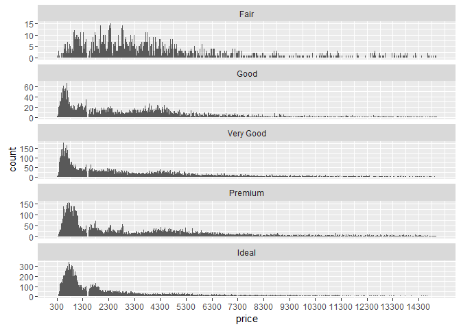


***

## Histogram of the price/carat, by cut - with free scale on y-axis


```r
qplot(data = diamonds, x = price/carat, binwidth = 0.05) +
  scale_x_log10() +
  facet_wrap(~cut, ncol = 1, scales = 'free_y')   
```

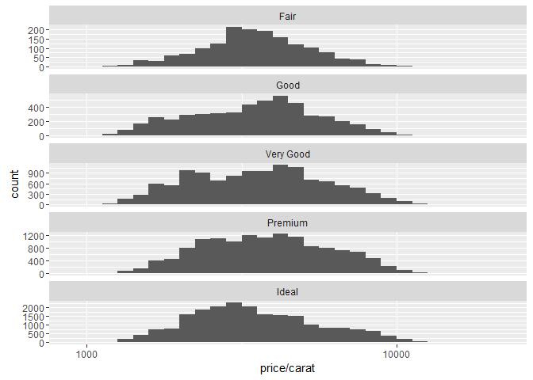

***

## Investigate the price of diamonds using box plots, numerical summaries, and one of the following categorical variables: cut, clarity, or color.


```r
qplot(data = diamonds, x = cut, y = price, 
      geom = 'boxplot')   
```

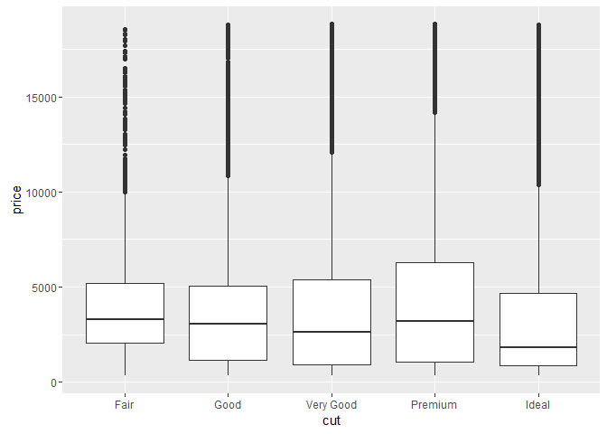

```r
qplot(data = diamonds, x = clarity, y = price, 
      geom = 'boxplot')   
```

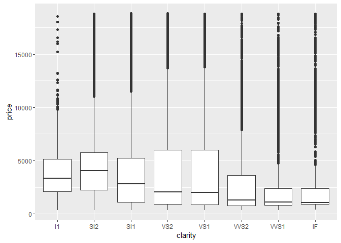

```r
qplot(data = diamonds, x = color, y = price, 
      geom = 'boxplot')   
```

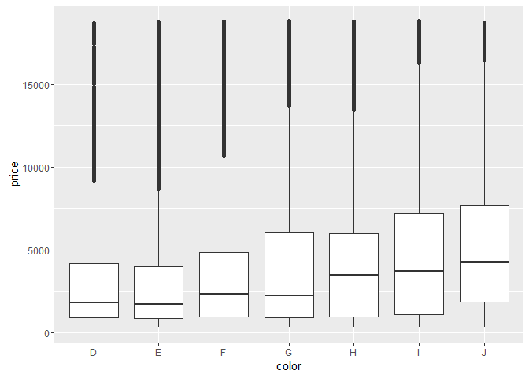


***

## Interquartile (IQR)


```r
# returns the summary per color 
by(diamonds$price, diamonds$color, summary)
```

```
## diamonds$color: D
##    Min. 1st Qu.  Median    Mean 3rd Qu.    Max. 
##     357     911    1838    3170    4214   18690 
## -------------------------------------------------------- 
## diamonds$color: E
##    Min. 1st Qu.  Median    Mean 3rd Qu.    Max. 
##     326     882    1739    3077    4003   18730 
## -------------------------------------------------------- 
## diamonds$color: F
##    Min. 1st Qu.  Median    Mean 3rd Qu.    Max. 
##     342     982    2344    3725    4868   18790 
## -------------------------------------------------------- 
## diamonds$color: G
##    Min. 1st Qu.  Median    Mean 3rd Qu.    Max. 
##     354     931    2242    3999    6048   18820 
## -------------------------------------------------------- 
## diamonds$color: H
##    Min. 1st Qu.  Median    Mean 3rd Qu.    Max. 
##     337     984    3460    4487    5980   18800 
## -------------------------------------------------------- 
## diamonds$color: I
##    Min. 1st Qu.  Median    Mean 3rd Qu.    Max. 
##     334    1120    3730    5092    7202   18820 
## -------------------------------------------------------- 
## diamonds$color: J
##    Min. 1st Qu.  Median    Mean 3rd Qu.    Max. 
##     335    1860    4234    5324    7695   18710
```

```r
# returns the IQR (3rd quart - 1rd quart = 75% - 25%) of price for best color
IQR(subset(diamonds, color == 'D')$price)
```

```
## [1] 3302.5
```

```r
# returns the IQR of price for worst color
IQR(subset(diamonds, color == 'J')$price)
```

```
## [1] 5834.5
```

***

## Investigate the price per carat of diamonds across the different colors of diamonds using boxplots.

Note: color doesnt affect very much the price/carat


```r
qplot(data = diamonds, x = color, y = price/carat, 
      geom = 'boxplot') 
```

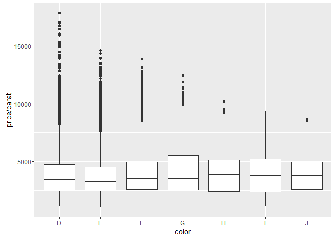

***

## Investigate the weight of the diamond (carat) using a frequency polygon


```r
qplot(data = diamonds, x = carat, binwidth = 0.007, 
      geom = 'freqpoly') +
  scale_x_continuous(limits = c(0, 1.5),
                     breaks = seq(0, 1.5, 0.1)) 
```

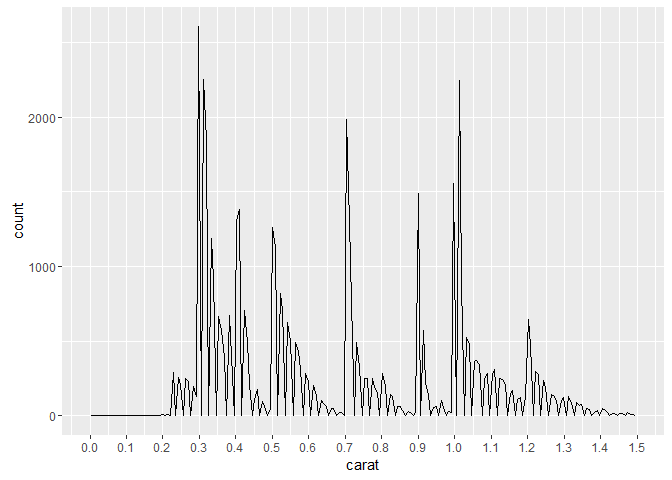

***

## Data munging or data wrangling

tidyr -a package that reshapes the layout of your data

dplyr - a package that helps you transform tidy, tabular data

***

2. Gapminder Dataset : Energy use in the world, per person
===========================================================================

#Loading data


```r
list.files()
```

```
##  [1] "birthdaysExample.csv"       "Electricity Generation.csv"
##  [3] "Lesson 3.rmd"               "Lesson_3.html"             
##  [5] "Lesson_3.md"                "Lesson_3_files"            
##  [7] "priceHistogram.png"         "Problem Set 3.rmd"         
##  [9] "Problem_Set_3.rmd"          "Problem_Set_3_files"       
## [11] "pseudo_facebook.tsv"
```

```r
electricity_df <- read.csv('Electricity Generation.csv', stringsAsFactors=FALSE
                        ,sep=",",head=TRUE)

summary(electricity_df)
```

```
##    country              X1990               X1991          
##  Length:64          Min.   :4.510e+09   Min.   :4.494e+09  
##  Class :character   1st Qu.:2.618e+10   1st Qu.:2.911e+10  
##  Mode  :character   Median :5.246e+10   Median :5.411e+10  
##                     Mean   :1.764e+11   Mean   :1.804e+11  
##                     3rd Qu.:1.389e+11   3rd Qu.:1.379e+11  
##                     Max.   :3.185e+12   Max.   :3.223e+12  
##      X1992               X1993               X1994          
##  Min.   :4.546e+09   Min.   :4.727e+09   Min.   :4.780e+09  
##  1st Qu.:2.903e+10   1st Qu.:3.005e+10   1st Qu.:2.953e+10  
##  Median :5.523e+10   Median :5.795e+10   Median :5.831e+10  
##  Mean   :1.823e+11   Mean   :1.865e+11   Mean   :1.913e+11  
##  3rd Qu.:1.468e+11   3rd Qu.:1.497e+11   3rd Qu.:1.506e+11  
##  Max.   :3.235e+12   Max.   :3.354e+12   Max.   :3.407e+12  
##      X1995               X1996               X1997          
##  Min.   :4.976e+09   Min.   :5.113e+09   Min.   :5.580e+09  
##  1st Qu.:2.762e+10   1st Qu.:2.981e+10   1st Qu.:3.165e+10  
##  Median :6.196e+10   Median :6.280e+10   Median :6.260e+10  
##  Mean   :1.979e+11   Mean   :2.041e+11   Mean   :2.082e+11  
##  3rd Qu.:1.566e+11   3rd Qu.:1.660e+11   3rd Qu.:1.754e+11  
##  Max.   :3.517e+12   Max.   :3.611e+12   Max.   :3.661e+12  
##      X1998               X1999               X2000          
##  Min.   :6.275e+09   Min.   :7.185e+09   Min.   :7.679e+09  
##  1st Qu.:3.498e+10   1st Qu.:3.715e+10   1st Qu.:3.568e+10  
##  Median :6.504e+10   Median :6.739e+10   Median :6.865e+10  
##  Mean   :2.137e+11   Mean   :2.193e+11   Mean   :2.292e+11  
##  3rd Qu.:1.744e+11   3rd Qu.:1.763e+11   3rd Qu.:1.897e+11  
##  Max.   :3.797e+12   Max.   :3.876e+12   Max.   :3.990e+12  
##      X2001               X2002               X2003          
##  Min.   :8.028e+09   Min.   :8.411e+09   Min.   :8.495e+09  
##  1st Qu.:3.731e+10   1st Qu.:3.851e+10   1st Qu.:4.057e+10  
##  Median :7.449e+10   Median :7.584e+10   Median :8.395e+10  
##  Mean   :2.327e+11   Mean   :2.407e+11   Mean   :2.498e+11  
##  3rd Qu.:1.938e+11   3rd Qu.:2.026e+11   3rd Qu.:2.110e+11  
##  Max.   :3.924e+12   Max.   :4.050e+12   Max.   :4.076e+12  
##      X2004               X2005               X2006          
##  Min.   :8.618e+09   Min.   :8.680e+09   Min.   :9.548e+09  
##  1st Qu.:4.101e+10   1st Qu.:4.184e+10   1st Qu.:4.509e+10  
##  Median :8.716e+10   Median :8.484e+10   Median :9.026e+10  
##  Mean   :2.610e+11   Mean   :2.721e+11   Mean   :2.832e+11  
##  3rd Qu.:2.193e+11   3rd Qu.:2.288e+11   3rd Qu.:2.376e+11  
##  Max.   :4.168e+12   Max.   :4.257e+12   Max.   :4.266e+12  
##      X2007               X2008          
##  Min.   :1.198e+10   Min.   :1.401e+10  
##  1st Qu.:4.264e+10   1st Qu.:4.322e+10  
##  Median :9.343e+10   Median :9.029e+10  
##  Mean   :2.961e+11   Mean   :3.005e+11  
##  3rd Qu.:2.454e+11   3rd Qu.:2.425e+11  
##  Max.   :4.365e+12   Max.   :4.316e+12
```

```r
str(electricity_df)
```

```
## 'data.frame':	64 obs. of  20 variables:
##  $ country: chr  "Algeria" "Argentina" "Australia" "Austria" ...
##  $ X1990  : num  1.61e+10 5.09e+10 1.56e+11 5.04e+10 2.32e+10 ...
##  $ X1991  : num  1.73e+10 5.41e+10 1.58e+11 5.15e+10 2.34e+10 ...
##  $ X1992  : num  1.83e+10 5.63e+10 1.62e+11 5.12e+10 1.97e+10 ...
##  $ X1993  : num  1.94e+10 6.25e+10 1.66e+11 5.27e+10 1.91e+10 ...
##  $ X1994  : num  1.99e+10 6.56e+10 1.70e+11 5.33e+10 1.76e+10 ...
##  $ X1995  : num  1.97e+10 6.72e+10 1.76e+11 5.66e+10 1.70e+10 ...
##  $ X1996  : num  2.07e+10 6.98e+10 1.80e+11 5.48e+10 1.71e+10 ...
##  $ X1997  : num  2.12e+10 7.25e+10 1.90e+11 5.69e+10 1.68e+10 ...
##  $ X1998  : num  2.36e+10 7.42e+10 2.00e+11 5.74e+10 1.79e+10 ...
##  $ X1999  : num  2.48e+10 8.07e+10 2.06e+11 6.04e+10 1.81e+10 ...
##  $ X2000  : num  2.50e+10 8.90e+10 2.12e+11 6.18e+10 1.87e+10 ...
##  $ X2001  : num  2.63e+10 9.01e+10 2.22e+11 6.18e+10 1.90e+10 ...
##  $ X2002  : num  2.74e+10 8.46e+10 2.27e+11 6.27e+10 1.87e+10 ...
##  $ X2003  : num  2.92e+10 9.20e+10 2.28e+11 6.02e+10 2.13e+10 ...
##  $ X2004  : num  3.09e+10 1.00e+11 2.37e+11 6.43e+10 2.17e+10 ...
##  $ X2005  : num  3.36e+10 1.06e+11 2.49e+11 6.06e+10 2.29e+10 ...
##  $ X2006  : num  3.50e+10 1.17e+11 2.55e+11 6.34e+10 2.45e+10 ...
##  $ X2007  : num  3.70e+10 1.21e+11 2.61e+11 6.37e+10 2.18e+10 ...
##  $ X2008  : num  4.00e+10 1.25e+11 2.72e+11 6.78e+10 2.16e+10 ...
```

#Distribution of electricty generation in the world in 1990 


```r
#Distribution of electricty generation in the world in 1990 (log scale)
qplot(data = electricity_df, x = X1990/10^9,
      xlab = 'Electricty generation (GWh)',
      ylab = 'Number of country in sample',
      main="Distribution of electricty generation in the world in 1990")
```

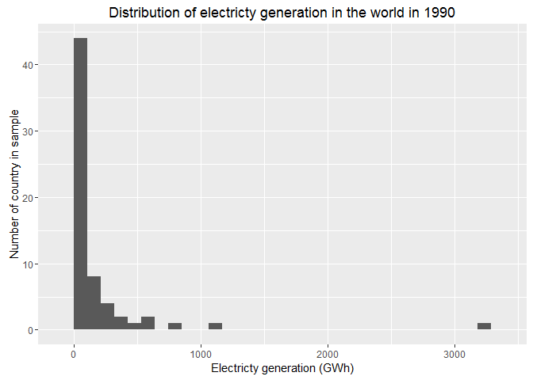

```r
#Distribution of electricty generation in the world in 1990 (log scale)
qplot(data = electricity_df, x = X1990/10^9,
      xlab = 'Electricty generation (GWh)',
      ylab = 'Number of country in sample',
      main="Distribution of electricty generation in the world in 1990 (log scale)") +
  scale_x_log10()
```

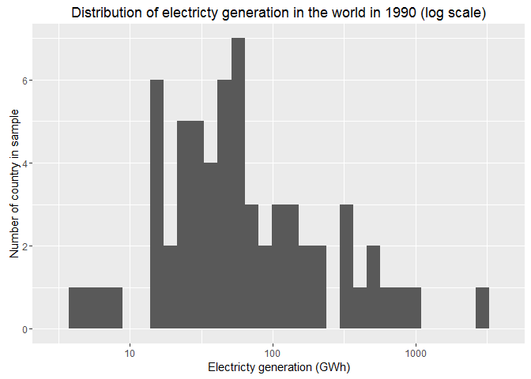

# Energy generation of Canada over time


```r
#install.packages('dplyr', dependencies = T)
#install.packages('tidyr', dependencies = T)
library(dplyr)
```


```r
library(tidyr)

canada_df <- electricity_df[ electricity_df$country == 'Canada' ,] 
canada_df <- canada_df[, -1]  #remove first column (to avoid the df to be factors and not numeric)
canada_df <- as.data.frame( t(canada_df) )
canada_df <- canada_df / 10^9

ggplot(data = canada_df,
       aes(x = rownames(canada_df), y = canada_df[,1] , group = 1   )) +
  geom_line() + geom_point() + geom_smooth() +
  ggtitle('Electricty generation in Canada')+
  xlab('Year') +
  ylab('Electricty generation (GWh)')
```


***

3. Birthday Dataset : Exploring Your Friends' Birthdays
===========================================================================

#Loading data


```r
list.files()
```

```
##  [1] "birthdaysExample.csv"       "Electricity Generation.csv"
##  [3] "Lesson 3.rmd"               "Lesson_3.html"             
##  [5] "Lesson_3.md"                "Lesson_3_files"            
##  [7] "priceHistogram.png"         "Problem Set 3.rmd"         
##  [9] "Problem_Set_3.rmd"          "Problem_Set_3_files"       
## [11] "pseudo_facebook.tsv"
```

```r
birthday_df <- read.csv('birthdaysExample.csv', stringsAsFactors=FALSE
                        ,sep=",",head=TRUE)

summary(birthday_df)
```

```
##     dates          
##  Length:1033       
##  Class :character  
##  Mode  :character
```

```r
str(birthday_df)
```

```
## 'data.frame':	1033 obs. of  1 variable:
##  $ dates: chr  "11/25/14" "6/8/14" "9/12/14" "5/26/14" ...
```

```r
birthday_df$dates <- strptime(birthday_df$dates,format='%m/%d/%y')
```

# How many people share your birthday? Do you know them?
# (Reserve time with them or save money to buy them a gift!)


```r
birthday_df$day <- as.numeric(format(birthday_df$dates, "%d"))  # equivalent to weekdays(birthday_df$dates)
birthday_df$month <- as.numeric(format(birthday_df$dates, "%m"))
birthday_df$year <- as.numeric(format(birthday_df$dates, "%Y"))

str(birthday_df)
```

```
## 'data.frame':	1033 obs. of  4 variables:
##  $ dates: POSIXlt, format: "2014-11-25" "2014-06-08" ...
##  $ day  : num  25 8 12 26 20 19 10 22 6 20 ...
##  $ month: num  11 6 9 5 2 6 10 10 7 9 ...
##  $ year : num  2014 2014 2014 2014 2014 ...
```

```r
birthday_df[ (birthday_df$month == 1) &  (birthday_df$day == 19) , ]
```

```
##          dates day month year
## 539 2014-01-19  19     1 2014
## 685 2014-01-19  19     1 2014
## 729 2014-01-19  19     1 2014
## 837 2014-01-19  19     1 2014
## 916 2014-01-19  19     1 2014
```

Note : 5 people share my BD.

# Which month contains the most number of birthdays?


```r
birthday_df$number <- 1
# group by month and sum 'birthday_df$number'
aggr1_df <- aggregate(birthday_df$number, by=list(birthday_df$month), FUN=sum)
aggr1_df
```

```
##    Group.1  x
## 1        1 89
## 2        2 79
## 3        3 98
## 4        4 81
## 5        5 72
## 6        6 93
## 7        7 86
## 8        8 91
## 9        9 96
## 10      10 89
## 11      11 87
## 12      12 72
```

```r
str(aggr1_df)
```

```
## 'data.frame':	12 obs. of  2 variables:
##  $ Group.1: num  1 2 3 4 5 6 7 8 9 10 ...
##  $ x      : num  89 79 98 81 72 93 86 91 96 89 ...
```

```r
# get the month with the max number
which.max(aggr1_df$x)
```

```
## [1] 3
```

The month with most number of birthdays is MARCH.

# How many birthdays are in each month?


```r
library(ggplot2)

ggplot(data=aggr1_df, aes(x=factor(Group.1),y=x)) +    # factor the months, for a better x scale
    geom_bar(stat="identity") +                       # use of stat="identity", cf below
    xlab('Month') +
    ylab('Number of people in sample')
```

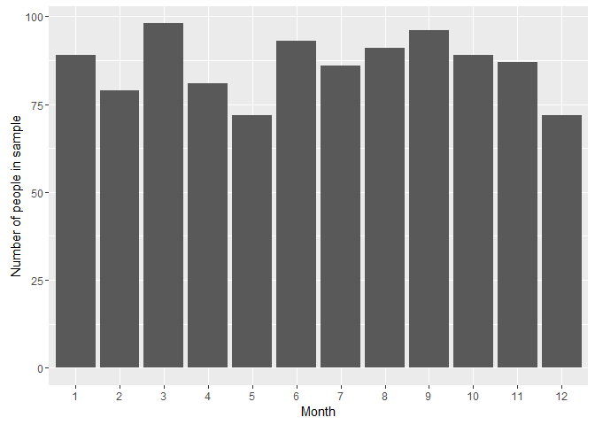

```r
# here, the height of the bar will represent the value in a column of the data frame. This is done by using stat="identity" instead of the default, stat="bin".
```

# Which day of the year has the most number of birthdays?


```r
# add a new column "day of year"
birthday_df$doy <- as.numeric(strftime(birthday_df$dates, format = "%j"))

birthday_df$number <- 1
# group by day of year and sum 'birthday_df$number'
aggr2_df <- aggregate(birthday_df$number, by=list(birthday_df$doy), FUN=sum)
aggr2_df
```

```r
str(aggr2_df)
```

```
## 'data.frame':	348 obs. of  2 variables:
##  $ Group.1: num  1 2 3 4 5 6 7 8 9 10 ...
##  $ x      : num  4 1 5 3 1 1 3 1 6 2 ...
```

```r
# get the doy with the max number
the_date <- as.numeric(which.max(aggr2_df$x))
the_date
```

```
## [1] 37
```

```r
# and get the associated date
temp1 <- birthday_df[ birthday_df$doy == the_date, ]['dates']
head(temp1,1)
```

```
##          dates
## 159 2014-02-06
```

```r
# and the number of occurences
dim(temp1)[1]
```

```
## [1] 8
```

This #37 has the most number of birthday. The date is Feb 6th. and occurs 8 times.


# Do you have at least 365 friends that have birthdays on everyday
# of the year?


```r
# create a list of 365 days
total_list_doy <- seq(1, 365, by=1)

# create a list of unique
unique_list_doy <- unique(sort(c(birthday_df$doy)))
length(unique_list_doy)
```

```
## [1] 348
```

```r
# what is different in total_list_doy
days_wo_birthday <- setdiff(total_list_doy,unique_list_doy)   
days_wo_birthday
```

```
##  [1]  39  52  53  65 106 111 123 144 177 215 218 235 315 317 340 347 357
```

```r
length(days_wo_birthday)
```

```
## [1] 17
```

Note : on 17 specific days of the year, there are no birthdays.
