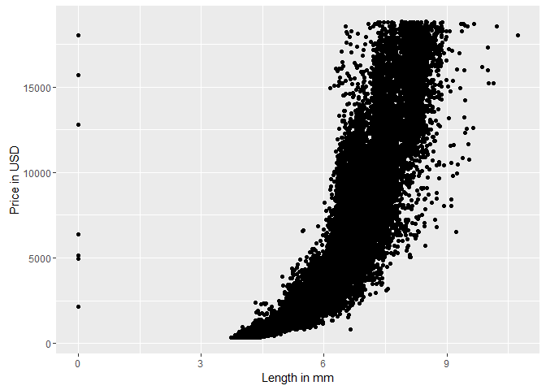
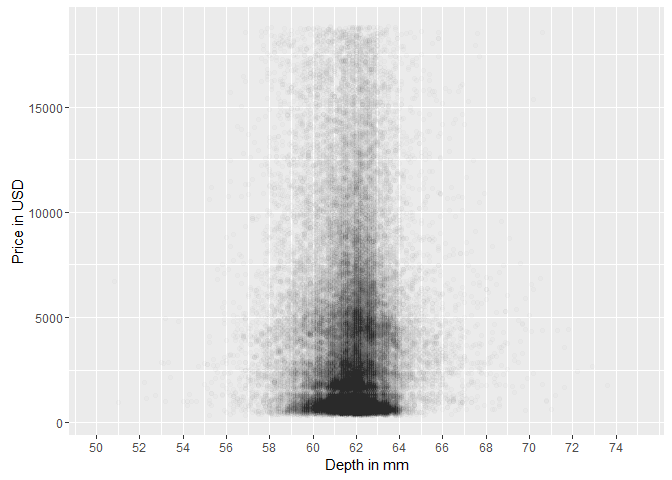
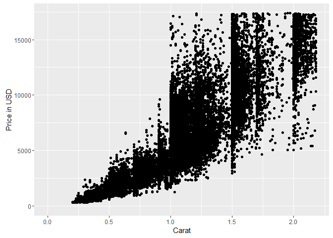
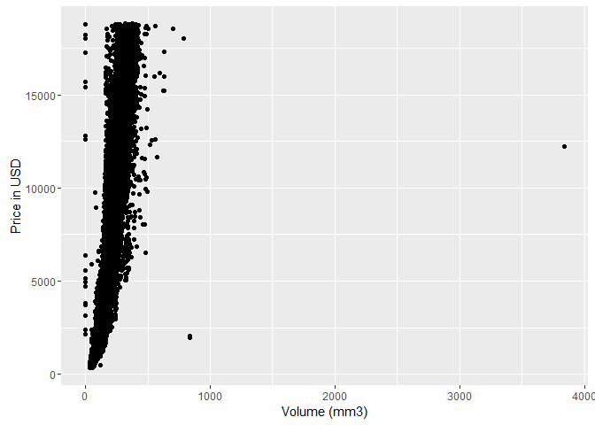
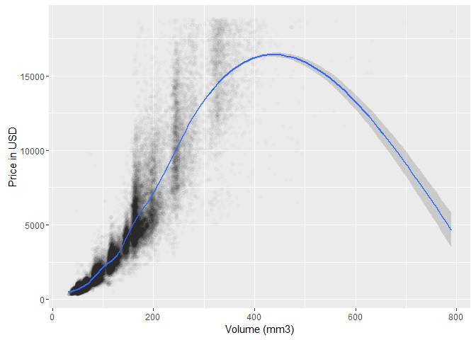
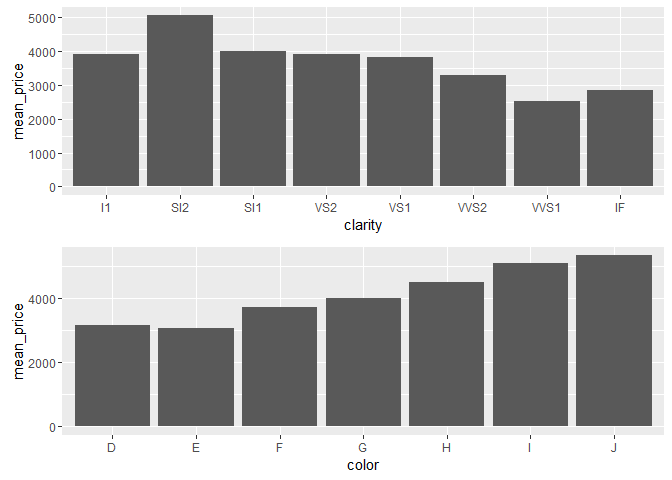
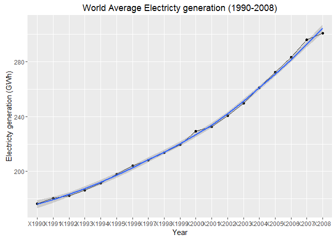
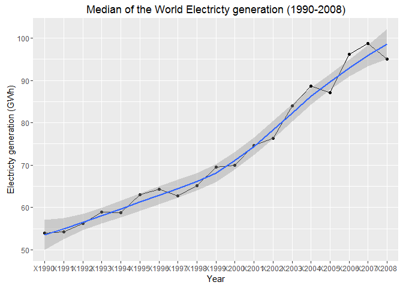
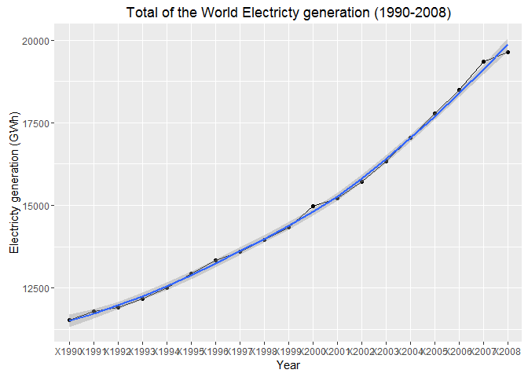
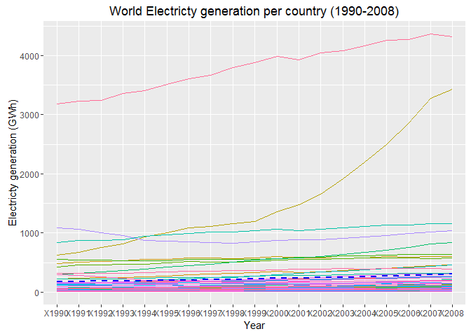

# Problem Data Set 4: Explore Two Variables
Nicolas  
March 15, 2016  


1. Diamonds Dataset (continued)
========================================================

***

### Loading the dataset


```r
library(ggplot2)
data(diamonds)
summary(diamonds)
```

```
##      carat               cut        color        clarity     
##  Min.   :0.2000   Fair     : 1610   D: 6775   SI1    :13065  
##  1st Qu.:0.4000   Good     : 4906   E: 9797   VS2    :12258  
##  Median :0.7000   Very Good:12082   F: 9542   SI2    : 9194  
##  Mean   :0.7979   Premium  :13791   G:11292   VS1    : 8171  
##  3rd Qu.:1.0400   Ideal    :21551   H: 8304   VVS2   : 5066  
##  Max.   :5.0100                     I: 5422   VVS1   : 3655  
##                                     J: 2808   (Other): 2531  
##      depth           table           price             x         
##  Min.   :43.00   Min.   :43.00   Min.   :  326   Min.   : 0.000  
##  1st Qu.:61.00   1st Qu.:56.00   1st Qu.:  950   1st Qu.: 4.710  
##  Median :61.80   Median :57.00   Median : 2401   Median : 5.700  
##  Mean   :61.75   Mean   :57.46   Mean   : 3933   Mean   : 5.731  
##  3rd Qu.:62.50   3rd Qu.:59.00   3rd Qu.: 5324   3rd Qu.: 6.540  
##  Max.   :79.00   Max.   :95.00   Max.   :18823   Max.   :10.740  
##                                                                  
##        y                z         
##  Min.   : 0.000   Min.   : 0.000  
##  1st Qu.: 4.720   1st Qu.: 2.910  
##  Median : 5.710   Median : 3.530  
##  Mean   : 5.735   Mean   : 3.539  
##  3rd Qu.: 6.540   3rd Qu.: 4.040  
##  Max.   :58.900   Max.   :31.800  
## 
```

***

### Create a scatterplot of price vs x

```r
ggplot(aes(x = x, y = price), data = diamonds) +
       xlab('Length in mm') +
       ylab('Price in USD') + 
  geom_point()
```



***

### Correlation between price and x, between price and y, between price and z


```r
cor.test(diamonds$price,diamonds$x)  # length in mm
```

```
## 
## 	Pearson's product-moment correlation
## 
## data:  diamonds$price and diamonds$x
## t = 440.16, df = 53938, p-value < 2.2e-16
## alternative hypothesis: true correlation is not equal to 0
## 95 percent confidence interval:
##  0.8825835 0.8862594
## sample estimates:
##       cor 
## 0.8844352
```

Correlation is 0.88

```r
cor.test(diamonds$price,diamonds$y)  # width in mm
```

```
## 
## 	Pearson's product-moment correlation
## 
## data:  diamonds$price and diamonds$y
## t = 401.14, df = 53938, p-value < 2.2e-16
## alternative hypothesis: true correlation is not equal to 0
## 95 percent confidence interval:
##  0.8632867 0.8675241
## sample estimates:
##       cor 
## 0.8654209
```

Correlation is 0.86

```r
cor.test(diamonds$price,diamonds$z)  # depth in mm
```

```
## 
## 	Pearson's product-moment correlation
## 
## data:  diamonds$price and diamonds$z
## t = 393.6, df = 53938, p-value < 2.2e-16
## alternative hypothesis: true correlation is not equal to 0
## 95 percent confidence interval:
##  0.8590541 0.8634131
## sample estimates:
##       cor 
## 0.8612494
```
Correlation is 0.86

***

### Create a scatterplot of price vs depth

Make the transparency of the points to be 1/100 of what they are now and mark the x-axis every 2 units.

```r
ggplot(aes(x = depth, y = price), data = diamonds) +
       xlab('Depth in mm') +
       ylab('Price in USD') + 
  geom_point(alpha=1/100) +
  scale_x_continuous(limits = c(50, 75),
                     breaks = seq(50,75, 2))    # mark the x-axis every 2 units
```



***

### Correlation between price and depth

```r
cor.test(diamonds$price,diamonds$depth)  # depth: total depth percentage = z / mean(x, y) = 2 * z / (x + y) (43-79)
```

```
## 
## 	Pearson's product-moment correlation
## 
## data:  diamonds$price and diamonds$depth
## t = -2.473, df = 53938, p-value = 0.0134
## alternative hypothesis: true correlation is not equal to 0
## 95 percent confidence interval:
##  -0.019084756 -0.002208537
## sample estimates:
##        cor 
## -0.0106474
```

***

### Create a scatterplot of price vs carat and omit the top 1% of price and carat values.

```r
ggplot(aes(x = carat, y = price), data = diamonds) +
       xlab('Carat') +
       ylab('Price in USD') + 
  geom_point() +
  xlim(0, quantile(diamonds$carat, probs = 0.99)) +   # 99% percentile on x variable
  ylim(0, quantile(diamonds$price, probs = 0.99))       # 99% percentile on y variable
```



***

### Create a scatterplot of price vs volume (x*y*z)

```r
diamonds$volume <- diamonds$x * diamonds$y * diamonds$z

ggplot(aes(x = volume, y = price), data = diamonds) +
       xlab('Volume (mm3)') +
       ylab('Price in USD') + 
  geom_point() 
```



```r
# number of diamonds with volume=0
dim(diamonds[diamonds$volume == 0,])
```

```
## [1] 20 11
```

```r
# Answer is 20.
```

***

### Correlation between price vs volume (x*y*z)

Exclude diamonds with volume=0 and volume >= 800


```r
temp_df <- diamonds[ diamonds$volume > 0 & diamonds$volume <= 800 , ]

cor.test(temp_df$price,temp_df$volume)
```

```
## 
## 	Pearson's product-moment correlation
## 
## data:  temp_df$price and temp_df$volume
## t = 559.19, df = 53915, p-value < 2.2e-16
## alternative hypothesis: true correlation is not equal to 0
## 95 percent confidence interval:
##  0.9222944 0.9247772
## sample estimates:
##       cor 
## 0.9235455
```

***

### Create a scatterplot of price vs volume (x*y*z)

```r
temp_df <- diamonds[ diamonds$volume > 0 & diamonds$volume <= 800 , ]

ggplot(aes(x = volume, y = price), data = temp_df) +
       xlab('Volume (mm3)') +
       ylab('Price in USD') + 
  geom_point(alpha=1/100) +
  geom_smooth()
```



The linear model is not a good fit.

***

### Create a new data frame containing info on diamonds by clarity

```r
library(dplyr)

clarity_groups  <- group_by(diamonds,clarity)     # first groups data by clarity

diamondsByClarity <- summarise(clarity_groups,                 # then summarizes
          mean_price = mean(price),                    # and creates new variables
          median_price = median(price),
          min_price = min(price),
          max_price = max(price),
          n = n()                                      # number of items in each group
          )

diamondsByClarity
```

```
## Source: local data frame [8 x 6]
## 
##   clarity mean_price median_price min_price max_price     n
##    (fctr)      (dbl)        (dbl)     (int)     (int) (int)
## 1      I1   3924.169         3344       345     18531   741
## 2     SI2   5063.029         4072       326     18804  9194
## 3     SI1   3996.001         2822       326     18818 13065
## 4     VS2   3924.989         2054       334     18823 12258
## 5     VS1   3839.455         2005       327     18795  8171
## 6    VVS2   3283.737         1311       336     18768  5066
## 7    VVS1   2523.115         1093       336     18777  3655
## 8      IF   2864.839         1080       369     18806  1790
```

***

### Create two bar plots : mean_price vs. clarity, mean_price vs. color

```r
library(dplyr)
library(ggplot2)

diamonds_by_clarity <- group_by(diamonds, clarity)
diamonds_mp_by_clarity <- summarise(diamonds_by_clarity, mean_price = mean(price))
p1 <- ggplot(aes(x = clarity, y = mean_price), data = diamonds_mp_by_clarity) +
  geom_bar(stat="identity")

diamonds_by_color <- group_by(diamonds, color)
diamonds_mp_by_color <- summarise(diamonds_by_color, mean_price = mean(price))
p2 <- ggplot(aes(x = color, y = mean_price), data = diamonds_mp_by_color) +
  geom_bar(stat="identity")

library(gridExtra)
grid.arrange(p1,p2,ncol=1)
```



***

2. Gapminder Revisited : Energy use in the world, per person
========================================================

Your task is to continue the investigation you did at the end of Problem Set 3. In your investigation, examine pairs of variable and create 2-5 plots that make use of the techniques from Lesson 4.

# Loading data

```r
electricity_df <- read.csv('Electricity Generation.csv', stringsAsFactors=FALSE
                        ,sep=",",head=TRUE)

rownames(electricity_df) <- electricity_df$country   # change the row names with the country names
electricity_df$country <- NULL   # remove the country name column
electricity_df <- as.data.frame( t(electricity_df) )  # and tranpose
electricity_df2 <- electricity_df
```

# Average electricty generation in the world in 1990 


```r
library(ggplot2)

electricity_df$Mean <- apply(electricity_df, 1, FUN = mean)   # add a new column 'Mean'

ggplot(aes(x = row.names(electricity_df), y = Mean/10^9,  group = 1), #  all points should be connected, so group=1
       data = electricity_df) +
  geom_line() + geom_point() + geom_smooth() +
  ggtitle('World Average Electricty generation (1990-2008)')+
  xlab('Year') +
  ylab('Electricty generation (GWh)')
```



# Median electricty generation in the world in 1990 

```r
library(ggplot2)

electricity_df$Median <- apply(electricity_df, 1, FUN = median)   # add a new column 'Median'

ggplot(aes(x = row.names(electricity_df), y = Median/10^9,  group = 1), #  all points should be connected, so group=1
       data = electricity_df) +
  geom_line() + geom_point() + geom_smooth() +
  ggtitle('Median of the World Electricty generation (1990-2008)')+
  xlab('Year') +
  ylab('Electricty generation (GWh)')
```



# Total electricty generation in the world in 1990

```r
library(ggplot2)

electricity_df$Total <- apply(electricity_df, 1, FUN = sum)   # add a new column 'Total'

ggplot(aes(x = row.names(electricity_df), y = Total/10^9,  group = 1), #  all points should be connected, so group=1
       data = electricity_df) +
  geom_line() + geom_point() + geom_smooth() +
  ggtitle('Total of the World Electricty generation (1990-2008)')+
  xlab('Year') +
  ylab('Electricty generation (GWh)')
```



# Electricty generation in the world in 1990-2008 compared to the average generation of all countries

```r
library(reshape2)
electricity_df$Mean <- apply(electricity_df, 1, FUN = mean)   # add a new column 'Mean'
electricity_df_long <- as.data.frame(melt(as.matrix(electricity_df2)))  # to be able to plot multiple column, first convert the df from wide format to long format (here with melt, same as Tidyr's Gather function). Note: melt as a matrix first in order to be able to use the rownames as a variable.

head(electricity_df_long)
```

```
##    Var1    Var2      value
## 1 X1990 Algeria 1.6104e+10
## 2 X1991 Algeria 1.7345e+10
## 3 X1992 Algeria 1.8286e+10
## 4 X1993 Algeria 1.9415e+10
## 5 X1994 Algeria 1.9883e+10
## 6 X1995 Algeria 1.9715e+10
```

```r
ggplot() + 
  geom_line(data=electricity_df_long, aes(x=Var1, y=value/10^9, colour=Var2, group=Var2)) + 
  theme(legend.position = "none") +
  ggtitle('World Electricty generation per country (1990-2008)') +
  xlab('Year') +
  ylab('Electricty generation (GWh)') + 
  geom_line(data = electricity_df, aes(x = row.names(electricity_df), y = Mean/10^9),linetype = 2, color ='black',size=1, group=1)
```


Alternatively, using summary stat:

```r
library(dplyr)

year_groups <- group_by(electricity_df_long, Var1)     # first groups data by year

data_by_year <- summarise(year_groups,
          generation_mean = mean(value) 
          )

data_by_year <- arrange(data_by_year, Var1)                 # and sort by year

data_by_year
```

```
## Source: local data frame [19 x 2]
## 
##      Var1 generation_mean
##    (fctr)           (dbl)
## 1   X1990    176355868813
## 2   X1991    180446875906
## 3   X1992    182267008234
## 4   X1993    186478653203
## 5   X1994    191320678063
## 6   X1995    197912788219
## 7   X1996    204088507125
## 8   X1997    208157059359
## 9   X1998    213747399250
## 10  X1999    219347951250
## 11  X2000    229157380297
## 12  X2001    232743624219
## 13  X2002    240717467188
## 14  X2003    249841476563
## 15  X2004    261030735328
## 16  X2005    272081673786
## 17  X2006    283157749694
## 18  X2007    296053681041
## 19  X2008    300497448713
```

```r
ggplot() + 
  geom_line(data=electricity_df_long, aes(x=Var1, y=value/10^9, colour=Var2, group=Var2)) + 
  theme(legend.position = "none") +
  ggtitle('World Electricty generation per country (1990-2008)') +
  xlab('Year') +
  ylab('Electricty generation (GWh)') + 
  geom_line(data = data_by_year, aes(x = Var1, y = generation_mean/10^9),linetype = 2, color ='black',size=1, group=1)
```


Alternatively, overlaying Summaries with Raw Data:

```r
ggplot(data=electricity_df_long, aes(x=Var1, y=value/10^9, colour=Var2, group=Var2)) + 
  geom_line() + 
  geom_line(stat = 'summary', fun.y = mean, linetype = 2, color ='blue',size=1, group=1) +
  theme(legend.position = "none") +
  ggtitle('World Electricty generation per country (1990-2008)') +
  xlab('Year') +
  ylab('Electricty generation (GWh)')
```



